# Partitioning Manual

---

***Beware! You can lose your data, proceed at your own risk!***

---

- [Partitioning Manual](#partitioning-manual)
  - [Tools](#tools)
  - [1. Lsblk Output](#1-lsblk-output)
  - [2. Target Disk](#2-target-disk)
  - [3. Boot mode](#3-boot-mode)
  - [4. Partitioning](#4-partitioning)
    - [(Theory)](#theory)
      - [A. Partition tables](#a-partition-tables)
      - [B. Partition Types](#b-partition-types)
        - [GPT](#gpt)
        - [MBR](#mbr)
      - [C. Needed Partitions](#c-needed-partitions)
      - [D. Recommended Partition Sizes](#d-recommended-partition-sizes)
    - [(Practice)](#practice)
      - [Parted Output](#parted-output)
      - [Unit of Measurement (Optional)](#unit-of-measurement-optional)
      - [Partition table (Optional)](#partition-table-optional)
      - [Partitioning Example](#partitioning-example)
      - [Example Scenerios](#example-scenerios)
        - [A. UEFI](#a-uefi)
        - [B. Legacy BIOS + GPT](#b-legacy-bios--gpt)
        - [C. Legacy BIOS + MBR](#c-legacy-bios--mbr)
    - [Quit](#quit)

## Tools

Below is the table of available partitioning tools for linux:

| Dialog | Pseudo-graphics | Graphical          | Non-interactive |
| ------ | --------------- | ------------------ | --------------- |
| fdisk  | cfdisk          | Gparted            | sfdisk          |
| gdisk  | cgdisk          | gnome-disk-utility | sgdisk          |
| parted | ---             | partitionmanager   | parted          |

This is a manual about how I get things done. So, I will be explaining `lsblk` and `parted`. For other tools you see on the upper table, please follow one of the various manuals on the internet. You can also be able to apply these descriptions after booting into archiso.

## 1. Lsblk Output

You can list your devices with `lsblk -o +path`.

Such as:

As you can see, all of the information is divided into certain columns. Important ones for us however are `NAME`, `SIZE`, `TYPE`, `MOUNTPOINTS` and `PATH`.

- `NAME`: Shows devices in a tree form. The head of the tree is your disk and below are its partitions.

- `SIZE`: Device size

- `TYPE`: Device type

  - `disk`: Data storage device
  - `part`: Partition
  - `crypt`: Encrypted device
  - `lvm`: Logical Volume
  - `rom`: Comes from `DVD/CD-ROM` means it is an optical device.

- `MOUNTPOINTS`: Shows where device is mounted on the system. (however, this indicator `[SWAP]` means swapping is enabled.)

- `PATH`: Path to access your device.

*(For other columns you see in the picture, please visit: <https://superuser.com/questions/778686/linux-lsblk-output>)*

Yet all of them are not limited to the ones that described above. To see what columns `lsblk` has, type `lsblk --help` in your terminal. You can then use them with `lsblk -o +column1,column2...` *(I mostly use `lsblk -o +partlabel`)*

## 2. Target Disk

In general, you should be familiar with above description and decide your target device according to it.

On the other hand, since we will be partitioning, we only need to know which `disk`'s are seen by our system.

Therefore, typing `lsblk -o +path | grep disk` will suffice. Then you can differ them by their sizes.

- `/dev/sda`: My main device (SSD).

- `/dev/sdb`: My target device (An old hard drive).

- `/dev/sdc`: My USB.

## 3. Boot mode

There are two boot modes:

- `UEFI` (Unified Extensible Firmware Interface)

- `Legacy BIOS` (Basic Input Output System)

To know which mode you are in, type: `ls /sys/firmware/efi/efivars`.

If you successfully run this command, then you are in `UEFI` mode.

If you encounter with this:

then you are in `Legacy BIOS` mode.

## 4. Partitioning

### (Theory)

Partitioning is a scheming process that allows the use of a data storage device.

#### A. Partition tables

There are two suitable partition tables for linux: `MBR` and `GPT`.

- `MBR` (a.k.a `msdos`) is the old fashioned way of handling partitions.

- `GPT` on the other hand is newer and offers more flexibility.

*(For more information about partition tables, visit: <https://wiki.gentoo.org/wiki/Handbook:AMD64/Installation/Disks#Partition_tables>)*

**Have to use `GPT` if:**

- your boot mode is `UEFI`
- your data storage device is bigger than `2TB`

**Have to use `MBR` if:**

- your boot mode is `Legacy BIOS` and want to dual boot with windows
- your boot mode is `Legacy BIOS` and experienced problems with `GPT`
- you want better compatibility with your elder hardware

#### B. Partition Types

Each partition table has its own way of handling partitions.

##### GPT

All partitions differ each other from their numbers and allocated regions. There are no exclusive types.

##### MBR

- `primary`: There could only be four `primary` partitions due to small space used at the beginning of the disk (usually 512 bytes).

- `extended`: To overcome `primary`'s restriction, this type is used. Thus, it allows a room for storing more partitions. (i.e. partitions in a partition)

- `logical`: The type that is used inside the `extended` partition.

#### C. Needed Partitions

|                   | EFI System Partition (ESP) | BIOS Grub | BOOT | SWAP | SYSTEM | HOME |
| ----------------- | :------------------------: | :-------: | :--: | :--: | :----: | :--: |
| UEFI              | x                          |           | x    | x    | x      | ±    |
| Legacy BIOS + GPT |                            | x         | x    | x    | x      | ±    |
| Legacy BIOS + MBR |                            |           | x    | x    | x      | ±    |

#### D. Recommended Partition Sizes

| EFI Sysetm Partition (ESP) | BIOS Grub | BOOT   | SWAP                                                                                                                                            | SYSTEM              | HOME             |
| :------------------------: | :-------: | :----: | :---------------------------------------------------------------------------------------------------------------------------------------------: | :-----------------: | :--------------: |
| 512MiB                     | 1MiB      | 500MiB | [Red Hat guidelines](https://access.redhat.com/documentation/en-us/red_hat_enterprise_linux/6/html/installation_guide/s2-diskpartrecommend-x86) | 32GiB (if seperate) | Rest of the disk |
|                            |           |        | [Ubuntu guidelines](https://help.ubuntu.com/community/SwapFaq#How_much_swap_do_I_need.3F)                                                       | Rest of the disk    |                  |

### (Practice)

Enough of theory right? Let's see some action!

To enter `parted`'s dialog mode, type: `parted YOUR_TARGET_DEVICE`

#### Parted Output

To see your current configuration, type `print`:

*Note: You can shorten your commands (e.g. `p` instead of `print`)*

In the above image, it is saying `Partition Table: msdos` which means our partition table is `MBR`. Hence `logical` partitions are starting from five.

If it were to belong a `GPT` partition table, it would look like this:

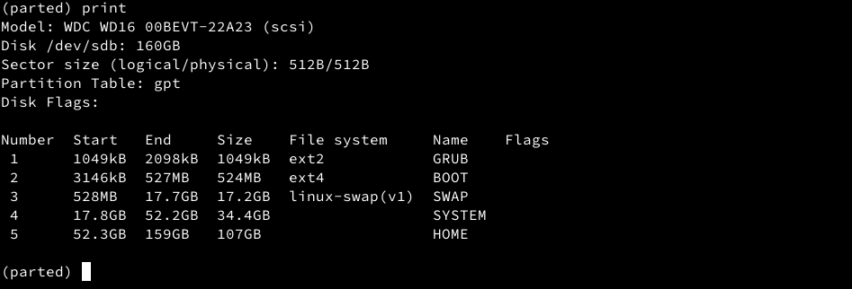

As you can see, there is a `Name` column instead of `Type`.

All columns seems pretty self-explanatory except for `Number` and `Flags` columns.

- `Number`: Indicates partition number.
- `Flags`: Indicates various options for that partition. *(To see all flags, please visit: <https://www.gnu.org/software/parted/manual/html_node/set.html>)*

#### Unit of Measurement (Optional)

Type `unit mib` to change your unit of measurement to `MiB`:

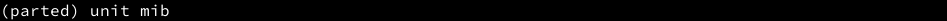

or `unit gib` to `GiB`:

#### Partition table (Optional)

Syntax: `mktable PARTITION_TABLE`

For example, type `mktable gpt`:

After `print`, it should look like this:

#### Partitioning Example

Let's say you don't want to delete your partitions and your partition scheme is like this:

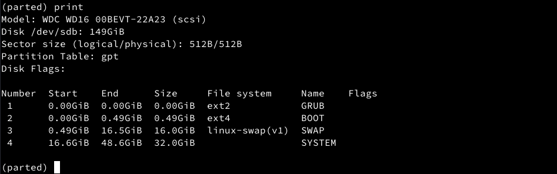

To make a new partition, `mktable NAME/TYPE START END` command is used. To choose your partition's starting location, you can either benefit from `MiB` output or `GiB` output. They differ from each other by precision (i.e. there will be unallocated space if `GiB` is used).

So your command would *definitely* be `mkpart "My Favourite Partition" 48.7gib 58.7gib`. Let's look how it seems:

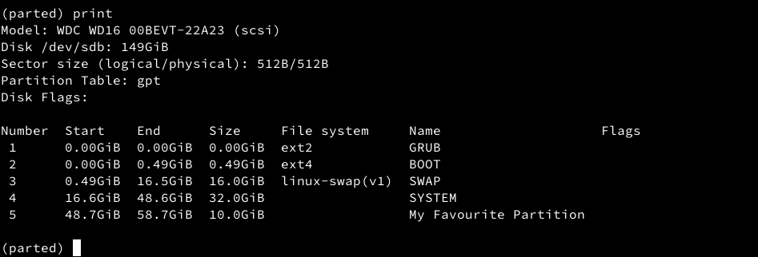

*(For my system, there is `103MiB` unallocated space left between fourth and fifth partitions.)*

Here is another example. This time we will use `MiB`:

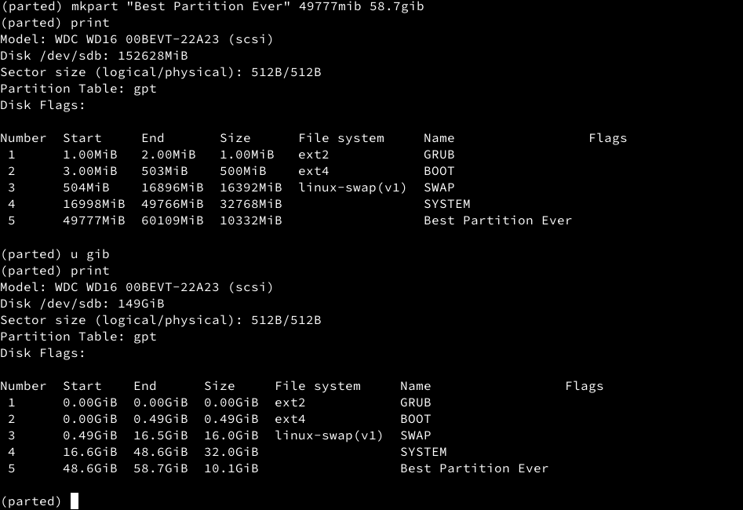

#### Example Scenerios

You don't need to `set` flags nor make a file system. `arch-setup` will make them for you.

*Note 1: I have `8GB` of `RAM`. According to [Red Hat guidelines](https://access.redhat.com/documentation/en-us/red_hat_enterprise_linux/6/html/installation_guide/s2-diskpartrecommend-x86) my needed swap size is `8 * 2 = 16GB`. (therefore, I will use `16GiB`)*

*Note 2: Lines starting with `(parted)` are my typed in commands.*

*Note 3: Parted accepts unit specification while making partitions. (`250gib`, `250mib`, `250` all are acceptable)*

*Note 4: `-1` means rest of the disk.*

*Note 5: If you encounter a warning likewise the image below, please follow these descriptions: <https://something.fail/blog/parted-multi-partition-alignment>*

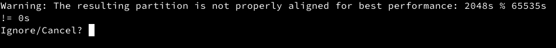

##### A. UEFI

Syntax: `mkpart NAME START END`

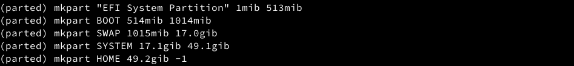

result:

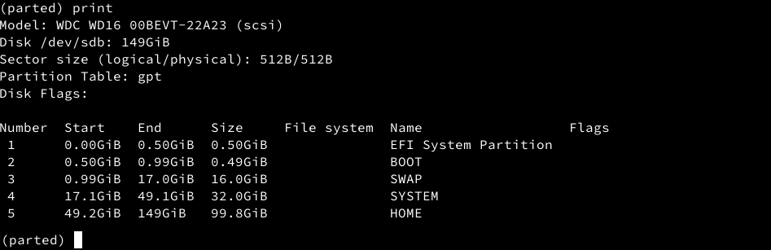

##### B. Legacy BIOS + GPT

Syntax: `mkpart NAME START END`

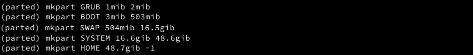

result:

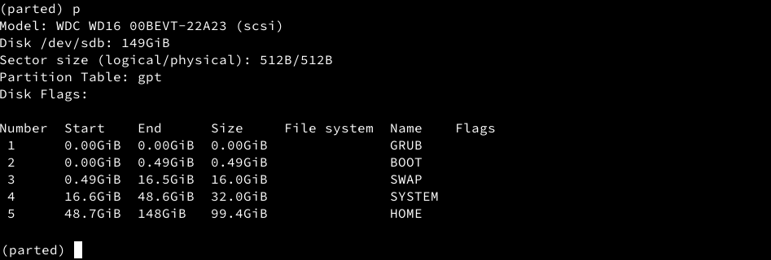

##### C. Legacy BIOS + MBR

Syntax: `mkpart TYPE START END`

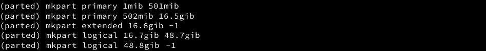

result:

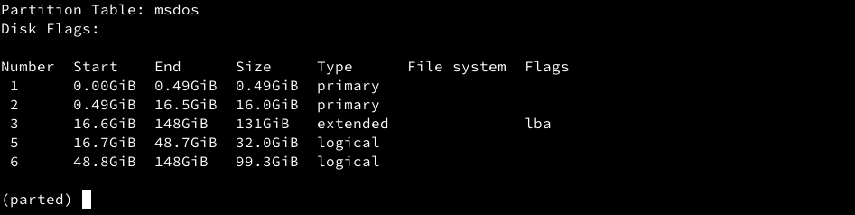

### Quit

type: `quit` or `q`
