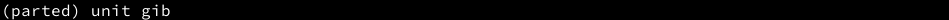

# Partitioning Manual

---

***Beware! You can lose your data, proceed at your own risk!***

---

- [Partitioning Manual](#partitioning-manual)
  - [Tools](#tools)
  - [1. Lsblk Output](#1-lsblk-output)
  - [2. Target Disk](#2-target-disk)
  - [3. Boot mode](#3-boot-mode)
  - [4. Partitioning](#4-partitioning)
    - [(Theory)](#theory)
      - [A. Partition tables](#a-partition-tables)
      - [B. Partition Types](#b-partition-types)
        - [GPT](#gpt)
        - [MBR](#mbr)
      - [C. Needed Partitions](#c-needed-partitions)
      - [D. Partition Sizes](#d-partition-sizes)
    - [(Practice)](#practice)
      - [Unit of Measurement (Optional)](#unit-of-measurement-optional)
      - [Partition table (Optional)](#partition-table-optional)
      - [Schemes](#schemes)
        - [A. UEFI](#a-uefi)
        - [B. Legacy BIOS + GPT](#b-legacy-bios--gpt)
        - [C. Legacy BIOS + MBR](#c-legacy-bios--mbr)

## Tools

Below is the table of available partitioning tools for linux:

| Dialog | Pseudo-graphics | Graphical          | Non-interactive |
| ------ | --------------- | ------------------ | --------------- |
| fdisk  | cfdisk          | Gparted            | sfdisk          |
| gdisk  | cgdisk          | gnome-disk-utility | sgdisk          |
| parted | ---             | partitionmanager   | parted          |

This is a manual about how I get things done. So, I will be explaining `lsblk` and `parted`. For other tools you see on the upper table, please follow one of the various manuals on the internet. You can also be able to apply these descriptions after booting into archiso.

## 1. Lsblk Output

You can list your devices with `lsblk -o +path`.

Such as:

As you can see, all of the information is divided into certain columns. Important ones for us however are `NAME`, `SIZE`, `TYPE`, `MOUNTPOINTS` and `PATH`.

- `NAME`: Shows devices in a tree form. The head of the tree is your disk and below are its partitions.

- `SIZE`: Device size

- `TYPE`: Device type

  - `disk`: Data storage device
  - `part`: Partition
  - `crypt`: Encrypted device
  - `lvm`: Logical Volume
  - `rom`: Comes from `DVD/CD-ROM` means it is an optical device.

- `MOUNTPOINTS`: Shows where device is mounted on the system. (however, this indicator `[SWAP]` means swapping is enabled.)

- `PATH`: Path to access your device.

*(For other columns you see in the picture, please visit: <https://superuser.com/questions/778686/linux-lsblk-output>)*

Yet all of them are not limited to the ones that described above. To see what columns `lsblk` has, type `lsblk --help` in your terminal. You can then use them with `lsblk -o +column1,column2...` *(I mostly use `lsblk -o +partlabel`)*

## 2. Target Disk

In general, you should be familiar with above description and decide your target device according to it.

On the other hand, since we will be partitioning, we only need to know which `disk`'s are seen by our system.

Therefore, typing `lsblk -o +path | grep disk` will suffice. Then you can differ them by their sizes.

- `/dev/sda`: My main device (SSD).

- `/dev/sdb`: My target device (An old hard drive).

- `/dev/sdc`: My USB.

## 3. Boot mode

There are two boot modes:

- `UEFI` (Unified Extensible Firmware Interface)

- `Legacy BIOS` (Basic Input Output System)

To know which mode you are in, type: `ls /sys/firmware/efi/efivars`.

If you successfully list the contents of that file, then you are in `UEFI` mode.

If you encounter with this:

then you are in `Legacy BIOS` mode.

## 4. Partitioning

### (Theory)

Partitioning is a scheming process that allows the use of a data storage device.

#### A. Partition tables

There are two suitable partition tables for linux. `MBR` and `GPT`.

`MBR` (a.k.a `msdos`) is the old fashioned way of handling partitions.

`GPT` on the other hand is newer and offers more flexibility.

*(For more information about partition tables, visit: <https://wiki.gentoo.org/wiki/Handbook:AMD64/Installation/Disks#Partition_tables>)*

**Have to use `GPT` if:**

- your boot mode is `UEFI`
- your data storage device is bigger than `2TB`

**Have to use `MBR` if:**

- your boot mode is `Legacy BIOS` and want to dual boot with windows
- your boot mode is `Legacy BIOS` and experienced problems with `GPT`
- you want better compatibility with your elder hardware

#### B. Partition Types

Each partition table has its own way of handling partitions.

##### GPT

All partitions differ each other from their numbers and allocated regions. There are no exclusive types.

##### MBR

- `primary`: There could only be four `primary` partitions due to small space used at the beginning of the disk (usually 512 bytes).

- `extended`: To overcome `primary`'s restriction, this type is used. Thus, it allows a room for storing more partitions. (i.e. partitions in a partition)

- `logical`: The type that is used inside the `extended` partition.

#### C. Needed Partitions

|                   | `EFI System Partition (ESP)` | `BIOS Grub` | `BOOT` | `SWAP` | `SYSTEM` | `HOME` |
| ----------------- | :--------------------------: | :---------: | :----: | :----: | :------: | :----: |
| UEFI              | x                            |             | x      | x      | x        | ±      |
| Legacy BIOS + GPT |                              | x           | x      | x      | x        | ±      |
| Legacy BIOS + MBR |                              |             | x      | x      | x        | ±      |

#### D. Partition Sizes

- `BIOS Grub`: `1MiB`
- `EFI System Partition`: `512MiB` recommended
- `BOOT`: `500MiB` recommended
- `SWAP`:
  - [Red Hat guidelines](https://access.redhat.com/documentation/en-us/red_hat_enterprise_linux/6/html/installation_guide/s2-diskpartrecommend-x86) *(I use this one)*
  - [Ubuntu guidelines](https://help.ubuntu.com/community/SwapFaq#How_much_swap_do_I_need.3F)
- `SYSTEM`:
  - if seperate: `32GiB` recommended
  - else: Rest of the disk
- `HOME`: Rest of the disk

### (Practice)

Enough of theory right? Let's see some action!

To enter `parted`'s dialog mode, type: `parted YOUR_TARGET_DEVICE`

and to see your current configuration, type `print`:

*Note 1: You can shorten these commands (e.g `print` to `p` or `mktable` to `mkt`)*

*Note 2: If you encounter a warning like the image below, please follow these descriptions: <https://something.fail/blog/parted-multi-partition-alignment>*

#### Unit of Measurement (Optional)

Type `unit mib` to change your unit of measurement to `MiB`:

or `unit gib`:

#### Partition table (Optional)

Type `mktable gpt`:

After `print`, it should look like this:

#### Schemes

*Note 1: I have `8GB` of `RAM`. According to [Red Hat guidelines](https://access.redhat.com/documentation/en-us/red_hat_enterprise_linux/6/html/installation_guide/s2-diskpartrecommend-x86) my needed swap size is `8 * 2 = 16GB`. (So I will use `16GiB`)*

*Note 2: Lines starting with `(parted)` are my typed in commands.*

*Note 3: Parted accepts unit specification while making partitions.*

*Note 4: You don't have to start from `1MiB` necessarily. Instead, you can start from your last partition's end unit + 1 (e.g: `985 + 1` in `MiB` or `37.8 + 0.1` in `GiB`)*

##### A. UEFI

Syntax: `mkpart PARTITION_NAME START END`

`GiB` output:

`MiB` output:

##### B. Legacy BIOS + GPT

Syntax: `mkpart PARTITION_NAME START END`

`GiB` output:

`MiB` output:

##### C. Legacy BIOS + MBR

Syntax: `mkpart PARTITION_TYPE START END`
